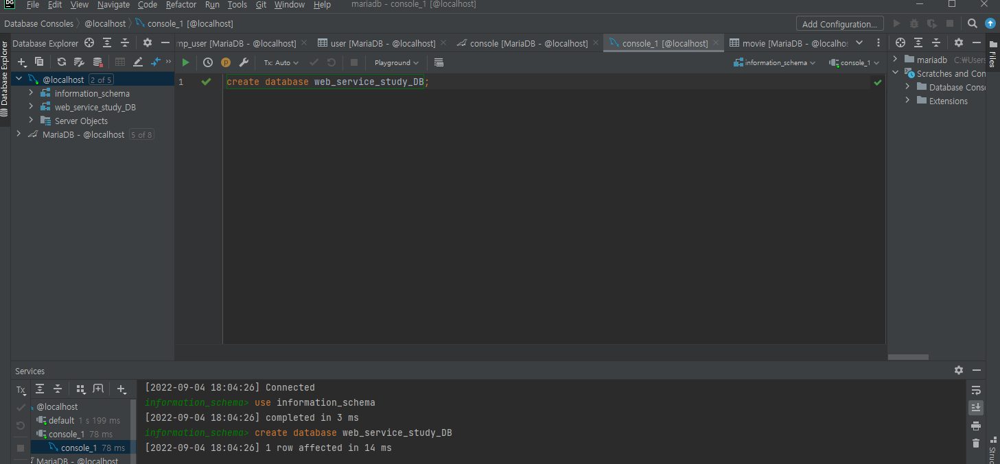

3주차. 개인 정리 내용

### 목차
1. window docker 설치
2. docker mysql 이미지 다운 및 container 실행
3. mysql 세팅

### 1.window docker 설치 
 - [docker window용 다운](https://docs.docker.com/desktop/install/windows-install/)
 - [WSL 2 installation is incomplete](https://blog.nachal.com/1691) -> docker 설치 후 뜰 경우    

   설치 완료 후 cmd 창 실행 후 아래 명령어 실행으로 docker 정상 설치 확인
 
        docker -v
        Docker version 20.10.12, build e91ed57
    
### 2.docker mysql 이미지 다운 및 container 실행
cmd 창 오픈 후 아래 명령어 순서대로  

    1.docker pull mysql -> 최신 버선 mysql 설치(명령어 치면 다운 막 받을거에요)

    2.docker images -> 다운 받은 이미지 확인 아래 처럼 뜨면 정상
    REPOSITORY        TAG       IMAGE ID       CREATED        SIZE
    mysql             latest    4390e6453173   10 days ago    447MB
    
    3.docker run --name <원하는 컨테이너 이름> -e MYSQL_ROOT_PASSWORD=<원하는 패스워드> -d -p 3306:3306 mysql
    ex) docker run --name sh-ex -e MYSQL_ROOT_PASSWORD=1234 -d -p 3306:3306 mysql 
    -> 각 옵션에 관한 건 검색해보시면 나옵니다 -p 옵션은 유용하니까 꼭 알아보세용

    4.docker ps -a -> 돌아가고 있는 컨테이너 확인 아래 처럼 뜨면 정상(id나 created, status는 다를거에요 제 기준이라)
    CONTAINER ID   IMAGE          COMMAND                  CREATED        STATUS                   PORTS                               NAMES
    55cb7d8d3515   mysql:latest   "docker-entrypoint.s…"   8 days ago     Up 58 minutes            0.0.0.0:3306->3306/tcp, 33060/tcp   mysql
    
    
5.docker exec -it <3번에서 지정한 컨테이너 이름> bash -> 컨테이너 내부로 접속  
6.mysql -u root -p  
  
password는 3번에서 MYSQL_ROOT_PASSWORD=1234 여기서 1234 부분입니다.
    

### 3.mysql 세팅 
해당 부분은 각자 사용하시는 db 툴로 진행하시면 좋을거 같습니다. 저는 제가 쓰는 툴로 진행하겠습니다
- db 연결

- query console 창 오픈 후 create database web_service_study_DB;

- 프로젝트 내 application.properties 작성
  - spring.datasource.driver-class-name=com.mysql.cj.jdbc.Driver
    spring.datasource.url=jdbc:mysql://localhost:3306/web_service_study_DB?useSSL=false&useUnicode=true&serverTimezone=Asia/Seoul
    spring.datasource.username=root
    spring.datasource.password=비밀번호
    spring.jpa.open-in-view=false

    

